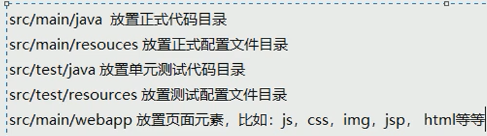
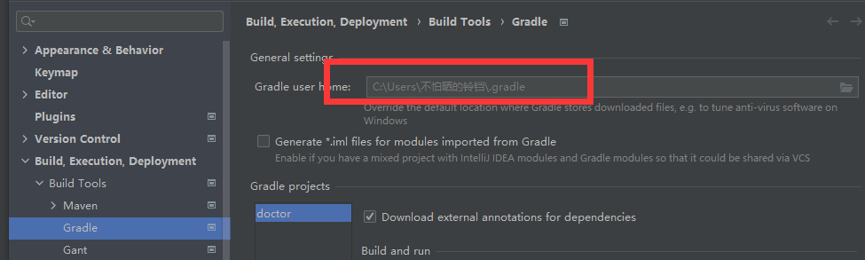

# Gradle安装配置

https://services.gradle.org/distributions/

下载bin.zip即可

解压之后配置环境变量，bin目录

## Idea集成Gradle

Settings中找到Gradle

当然在创建项目之后再配置也可以

# Groovy语言简介

> 和Python很像

省略分号、括号

- 当然如果函数是无参的还是加个空括号

定义变量：`def`

- 弱类型，自动推断

集合：`[]`

- 添加元素：`list << elem`

键值对集合：`[key: value]`

- 添加键值对：`map.newKey = newValue`

方法：`def method(params) {}`

闭包：`{}`

- 一段代码块

- 在gradle中当参数来使用

- 不带参数的闭包

  ```groovy
  def b1 = {
      println 'hello b1'
  }
  
  def method1(Closure closure) {
      closure()
  }
  
  method1 b1
  ```

- 带参数的闭包

  ```groovy
  def b2 = {
      v1, v2 ->
          println "hello ${v1}, ${v2}"
          println v1
          println v2
  }
  
  def method2(Closure closure) {
      closure('SunDocker', 'DockerSun')
  }
  
  method2 b2
  ```

  > 注意使用`${}`时需要用双引号

# Gradle仓库配置

目录结构：



build.gradle中依赖

```groovy
dependencies {
    testImplementation 'org.junit.jupiter:junit-jupiter-api:5.7.0'
    testRuntimeOnly 'org.junit.jupiter:junit-jupiter-engine:5.7.0'
}
```

> `testXxx`是作用域，后面是`group:artifact:verison`

所使用仓库：

```groovy
repositories {
    mavenCentral()
}
```

>`mavenCentral`是使用中央仓库，所有需要的jar包都会默认从中央仓库下载到本地这里配置的地方：
>
>

- 配置本地仓库
  1. 可以复制之前**Maven仓库的路径**，配置为变量`GRADLE_USER_HOME`的值


# Gradle入门案例


# Gradle与JavaWEB


# Gradle多模块